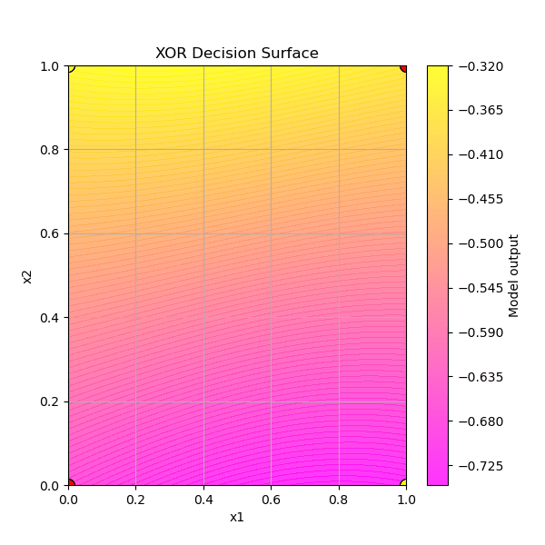
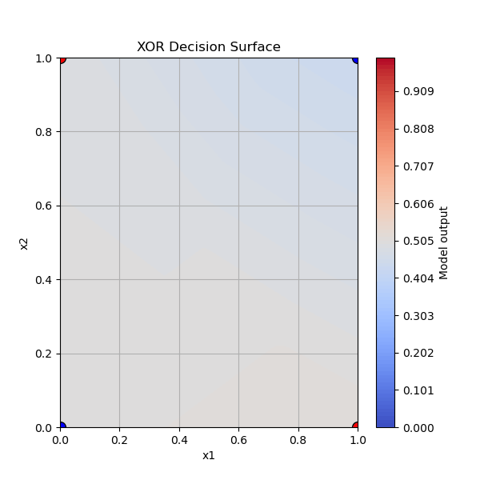

#XOR Classification
A second experiment (non-linear) for the micrograd build

##Things that this one forced me to do/think about:
  - Altering activation functions in hidden/output layers.
      - Updated the neural net to accept activation inputs (tanh, sigmoid, relu, leaky_relu, None=> linear activation)
  - Since the input is 2D we got to experiment with some training visuals (contour plots)
      - Example with a <ins>single hidden layer</ins> of **2** neurons and **750** epochs:  
      - Example with <ins>two hidden layers</ins> of **8** and **4** neurons respectively and **1200** epochs: 
      - tbc...
