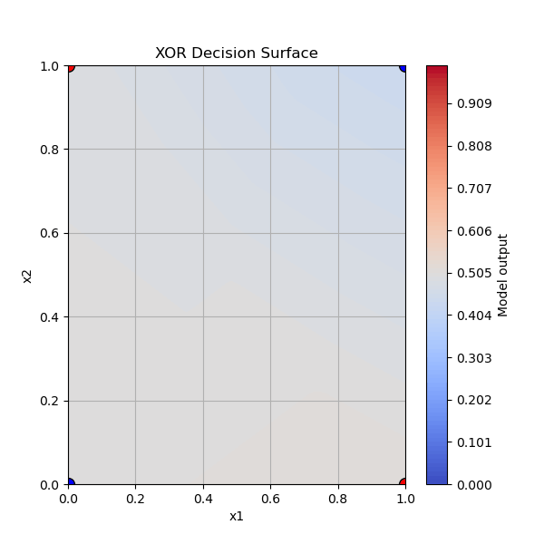
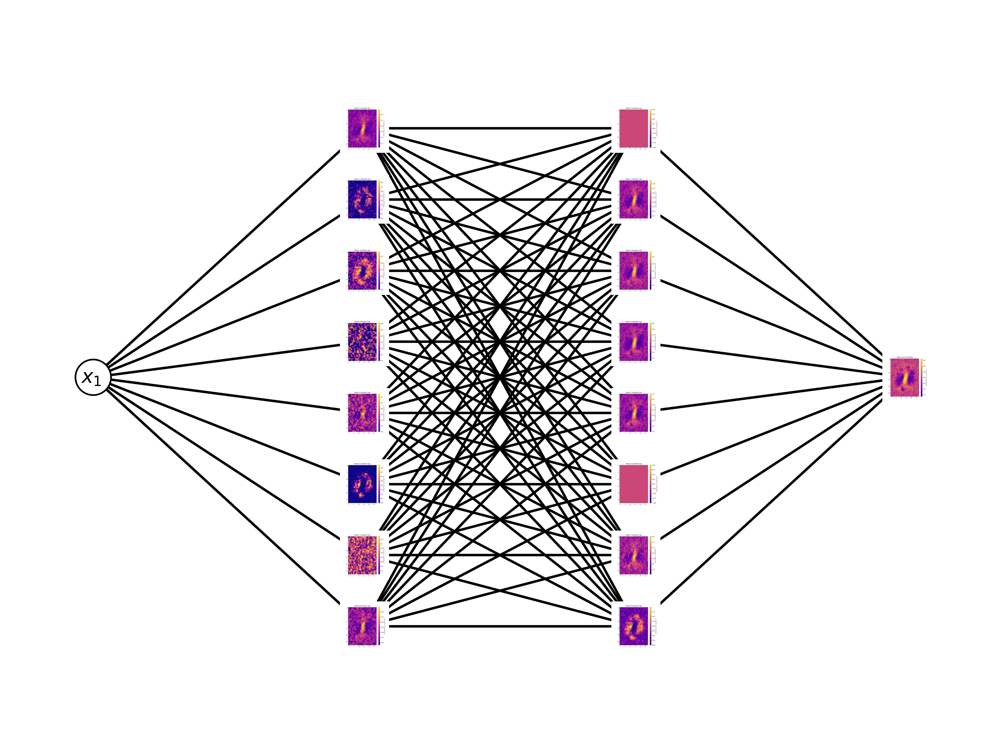

# Episode 1: Micrograd

## micrograd/
This folder contains the first stage of my hands-on machine learning journey, following and extending Andrej Karpathy’s *micrograd*. The goal was to build a neural net from scratch to understand how backpropagation is implemented and then test it on various problems — from toy problems like XOR to real world data like MNIST.

  - **engine.py**: Implements the Value class — essentially a scalar-valued tensor with a computation graph to enable autodiff. This follows Karpathy’s original structure with a few extensions (e.g., support for custom activation functions).
  - **nn.py**: Contains the core neural network building blocks: Neuron, Layer, and MLP. The MLP constructor allows for different activation functions for hidden and output layers:

    `MLP(3, [18, 8, 1], inner_activation='tanh', final_activation='sigmoid')`

  This will define a model with 3 inputs, 2 hidden layers (of 18 and 8 neurons resp.) and a sigmoid output. 

## experiments/
  This folder contains various experiments that we used to test micrograd. Throughout the experiments we probed the model, trying to understand how the training process affected model predictions and individual neuron activations. Here are the summaries of what we did:
  
  - **Linear regression**.
    The first basic test... can this model linear data?? Key insight was that tanh as an outter activation function does not predict linear trends in data very well! Updating the MLP to allow specialized activations in the layers solved this! Anyways, it was a nice confirmation that the model works and predicts linear data well enough!
  
  
  - **XOR**.
    The next step, *non-linear data*. 
    **Key insight**: in retrospect I should have used a margin based classifier (like hinge loss) here... alas, I did not. The cross-entropy loss worked but was not optimal. Nonetheless, we were able to visualize the evolution of the decision surface over the course of the training:
    
      
     - TO DO: rerun this with hinge loss for comparison!
        
  -  **2D-partition (Moons dataset)**.
      A slight generalization of XOR taken from Kaparthy's github. Again this is only a 2D binary classification task but it is a bit more complex than XOR. Using hinge loss made a major difference: it gave really clear decision boundaries as compared with XOR experiments. 
     

    
  -  **MNIST**.
      This tested the limits of micrograd: attempting to train a micrograd model on MNIST data to distinguish between 0s and 1s.       -  Initial experimentation was very slow but after reducing batch sizes, we made *some* progress... eventually I just ported the setup to PyTorch.
     - In Pytorch the same setup that I used with micrograd (MLP with 2 hidden layers of 8 neurons) ran in seconds and achieved 99.91% accuracy on the test dataset. The two examples that it failed to correctly identify had the following shapes (which seems fair!):
      -  , 
    - **Visualization** We also explored nterpretability by attempting to understand *where the model is 'looking' to make its decisions*. The idea was to create something like the decision surface above: basically we loop over all pixel positions in the 28x28 grid, and for each iteration we give the model an input that has a single non-zero pixel and record each neurons activations. Stitching together all of these activations we obtain the following '*pixel-activation*' plot:
 

## Some takeaways 
  - Implementing this neural network from scratch helped me hone my knowledge
  - The experiments helped to highlight how the choice of activation functions and loss changes the behavior of the model.
  - I have a much better understanding of the power of PyTorch, but it also made this jump seem very natural and motivated.
  - My attempts at visualization have deepened my interest in interpretability, and I am excited to continue work in this direction, hopefully reproducing some of the recent research in this area. 
